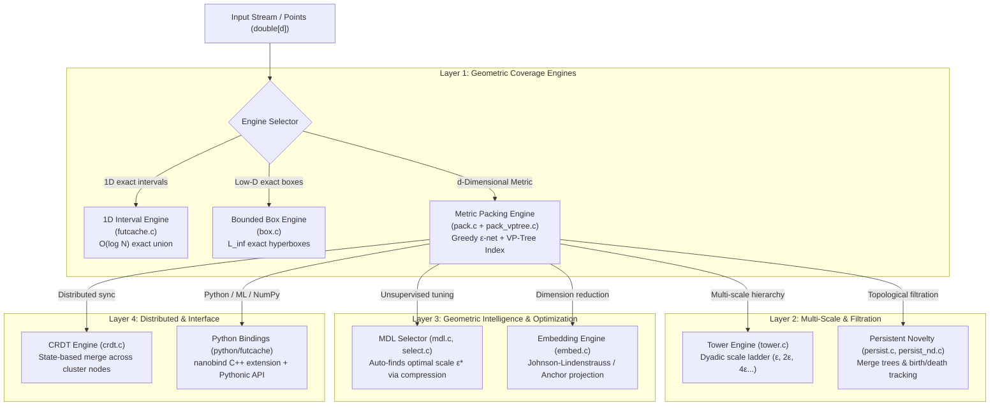

# FUTCache: The 30,000-Foot Mental Map & Usage Guide

> **"A cache that remembers *neighborhoods*, not exact keys."**

This document cuts through the mathematical and implementation complexity accumulated over 3 weeks of development. Use this as your high-level reference manual to eliminate mental overhead, understand the role of every file, and immediately know which API to reach for.

---

## 1. The Core Mental Model

Most caching systems answer questions about point-identities or timestamps. FUTCache answers a question about **geometric coverage in metric space**:

```
+-------------------------------------------------------------------------------+
|  Hash Map / Redis  | Exact byte equality  | "Have I seen this exact key?"    |
|  LRU / LFU         | Temporal recency     | "Have I seen this recently?"     |
|  Vector DB / ANN   | Similarity search    | "What are the top-K closest?"    |
|  FUTCache          | Covered regions      | "Have I explored this area?"     |
+-------------------------------------------------------------------------------+
```

### The Flashlight Analogy
Imagine sweeping a flashlight across a dark room:
- A **hash map** records the exact coordinates of every spot you pointed at.
- An **LRU cache** records the timestamp and order of spots you pointed at.
- **FUTCache** remembers the **illuminated regions**:
  - Anything landing inside a lit $\varepsilon$-ball is **redundant** (already visited / known).
  - Anything landing outside all lit regions is **novel** (new ground).

### The Invariant: One-Sided Conservative Novelty
* **Never swallows outliers:** If a point is genuinely new ($d(x, R) > \varepsilon$), FUTCache will **never** claim it is old.
* **Bounded by Geometry, not Time:** In a compact space $K$ at scale $\varepsilon$, the number of representatives is mathematically bounded by the packing number $P(K, \varepsilon)$, regardless of whether your stream processes $1,000$ or $1,000,000,000$ points.

---

## 2. System Architecture & Component Hierarchy



---

## 3. Decision Tree: Which Engine Do I Use?

When starting a task, ask these simple questions to pick the right engine:

```
                      Do you have a specific target epsilon (scale)?
                                     /             \
                                   YES              NO
                                  /                   \
        Is your data 1-dimensional?                 Use MDL Selector (mdl.h / select.py)
               /            \                       to find description-optimal ε* first.
             YES             NO
             /                 \
  Use futcache.h          Are you in d dimensions (L2, Cosine, Linf, Poincaré)?
  (Exact 1D intervals)          /
                              YES
                             /
                  Do you need multiple resolutions simultaneously?
                               /              \
                             YES               NO
                            /                   \
                 Use Tower Engine (tower.h)   Do you have multiple nodes / workers?
                 or PersistentNoveltyND              /                     \
                                                   YES                      NO
                                                   /                         \
                                          Use CRDT (crdt.h)        Use PackCache (pack.h / python)
                                          (conflict-free merge)    (Standard workhorse)
```

### Engine Feature Matrix

| Engine | Dimension | Distance Metric | State Bound | Primary Use Case |
|---|---|---|---|---|
| **`futcache`** | 1D | $L_1 / L_2 / L_\infty$ | Exact interval count | 1D thresholds, timeline coverage, timestamps |
| **`box`** | Low-D ($d \le 4$) | $L_\infty$ (Boxes) | Exact box union | Bounded hyperbox coverage, parameter sweeps |
| **`pack`** | Arbitrary $d$ | $L_1, L_2, L_\infty$, Cosine, Poincaré, Custom | $P(K, \varepsilon)$ or hard byte limit | **Semantic LLM caching**, embedding dedup, anomaly detection |
| **`tower`** | Arbitrary $d$ | Any metric | Geometric sum of levels | Multi-scale discovery, zoomable novelty |
| **`persist`** | 1D & $d$-D | Any metric | Merge tree / filtration | Topological novelty analysis, persistent features |
| **`crdt`** | Arbitrary $d$ | Any metric | Set union bound | Distributed edge workers, peer-to-peer sync |

---

## 4. Codebase Reference Map

Every source and header file organized by subsystem:

### C Core (`include/futcache/` & `src/`)
| Header | Source | Subsystem | Responsibility |
|---|---|---|---|
| [`futcache.h`](include/futcache/futcache.h) | [`futcache.c`](src/futcache.c) | **1D Interval Core** | Canonical sorted interval list, merge overlapping $[x-\varepsilon, x+\varepsilon]$, CRC32 snapshots. |
| [`box.h`](include/futcache/box.h) | [`box.c`](src/box.c) | **Box Engine** | Exact union of axis-aligned hyperboxes. |
| [`pack.h`](include/futcache/pack.h) | [`pack.c`](src/pack.c) | **Metric Packing Cache** | Greedy $\varepsilon$-net maintaining representative Voronoi centers. Supports FIFO/W1 eviction and byte limits. |
| *(internal)* | [`pack_vptree.c`](src/pack_vptree.c) | **VP-Tree Spatial Index** | Vantage Point Tree index for logarithmic nearest-neighbor pruning via triangle inequality. |
| [`tower.h`](include/futcache/tower.h) | [`tower.c`](src/tower.c) | **Scale Tower** | Hierarchy of packing caches at dyadic resolutions ($\varepsilon \cdot 2^k$). |
| [`persist.h`](include/futcache/persist.h) | [`persist.c`](src/persist.c) | **1D Persistence** | Single-linkage merge tree, persistence diagrams, Selberg zeta diagnostics. |
| [`persist_nd.h`](include/futcache/persist_nd.h) | [`persist_nd.c`](src/persist_nd.c) | **N-D Persistence** | Scale-resolved novelty queries and persistence-ranked eviction on $d$-dimensional $\varepsilon$-nets. |
| [`mdl.h`](include/futcache/mdl.h) | [`mdl.c`](src/mdl.c) | **MDL Principle** | Code length calculations (model complexity + data residual) to evaluate resolution quality. |
| [`select.h`](include/futcache/select.h) | [`select.c`](src/select.c) | **Submodular Selection** | Greedy $(1 - 1/e)$ max-coverage representative subset selection. |
| [`crdt.h`](include/futcache/crdt.h) | [`crdt.c`](src/crdt.c) | **CRDT Replication** | State-based CRDT merging representative nets across asynchronous nodes. |
| [`embed.h`](include/futcache/embed.h) | [`embed.c`](src/embed.c) | **Metric Embeddings** | Anchor-distance embeddings and JL projections with certified distortion bounds. |

### Python Bindings (`python/futcache/`)
| File | Class / Export | Purpose |
|---|---|---|
| [`__init__.py`](python/futcache/__init__.py) | `PackCache`, `NoveltyResult`, `PersistentNovelty`, `PersistentNoveltyND` | Clean, high-level Python API with NumPy integration and payload management. |
| [`adaptive.py`](python/futcache/adaptive.py) | `AdaptiveRadiusController`, `CompactIsolationForest` | Dynamic per-sample radius controllers based on local density and isolation. |
| [`epsilon_tree.py`](python/futcache/epsilon_tree.py) | `EpsilonTree` | Multi-resolution tree for querying coverage across continuous scale ranges. |
| [`_core.cpp`](python/futcache/_core.cpp) | nanobind bridge | Direct zero-copy C++ / nanobind bindings to `libfutcache`. |

---

## 5. End-to-End Usage Flows

### Flow 1: Semantic LLM / RAG Answer Caching (Python)
Save money and latency by reusing LLM answers when user embeddings land within an $\varepsilon$-ball of a previous query.

```python
from futcache import PackCache
import numpy as np

# 1. Initialize cache (e.g. 384-dim embeddings from all-MiniLM-L6-v2)
cache = PackCache(
    dimension=384,
    epsilon=0.40,          # Acceptance radius (cosine distance)
    distance="cosine",
    backend="vptree",      # Fast O(log N) indexing
    ttl=3600.0,            # 1 hour expiration on payloads
    max_memory_bytes=100 * 1024 * 1024  # 100 MB hard ceiling
)

def call_expensive_llm(embedding):
    print("Calling OpenAI / Gemini API...")
    return b"This is the detailed synthesized response from the LLM."

# 2. Query or compute in one atomic step
user_query_embedding = np.random.randn(384).astype(np.float64)
user_query_embedding /= np.linalg.norm(user_query_embedding)

response, novelty_info = cache.get_or_compute(
    user_query_embedding, 
    compute=call_expensive_llm
)

print(f"Novelty: {novelty_info.is_novel}, Rep ID: {novelty_info.representative_id}")
print(f"Response: {response.decode()}")
```

---

### Flow 2: Streaming Anomaly / Outlier Detection (C11)
Filter out routine telemetry and trigger alerts only when an event falls in unvisited metric territory.

```c
#include <stdio.h>
#include "futcache/pack.h"

int main(void) {
    futcache_pack_config config = {
        .dimension = 4,
        .epsilon = 0.25,
        .distance_type = FUTCACHE_DIST_L2,
        .backend = FUTCACHE_PACK_BACKEND_VPTREE,
        .max_memory_bytes = 1024 * 1024 /* 1 MB */
    };

    futcache_pack *cache = NULL;
    futcache_pack_create(&config, &cache);

    double sensor_reading[4] = {1.2, 0.4, -0.8, 3.1};
    futcache_novelty_result res;

    // Observe reading
    futcache_pack_observe(cache, sensor_reading, &res);

    if (res.is_novel) {
        printf("ANOMALY DETECTED! First time observing this region (Distance: %.3f)\n", 
               res.distance);
    } else {
        printf("Normal operation: point covered by representative %zu\n", 
               res.representative_id);
    }

    futcache_pack_destroy(cache);
    return 0;
}
```

---

### Flow 3: Finding Natural Resolution $\varepsilon^*$ with MDL
When you don't know what $\varepsilon$ to choose, use Minimum Description Length (MDL) to let the geometry choose the most compressed representation.

```python
import numpy as np
from futcache import select_max_coverage

# Generate or load unlabeled data
points = np.random.randn(1000, 16)

# Test candidate resolutions
candidate_epsilons = [0.1, 0.2, 0.4, 0.8, 1.6]
k_representatives = 50

for eps in candidate_epsilons:
    result = select_max_coverage(
        points=points,
        n=1000,
        dimension=16,
        epsilon=eps,
        k=k_representatives,
        distance="l2"
    )
    print(f"Epsilon: {eps:.2f} -> Coverage: {result['coverage_ratio'] * 100:.1f}%")
```

---

### Flow 4: Distributed Fleet Synchronization (CRDT)
Multiple edge instances process streams independently and synchronize their coverage state without a central coordinator.

```c
#include <stdlib.h>
#include "futcache/crdt.h"

// Node A and Node B create independent visited sets
futcache_crdt *node_a = futcache_crdt_create(dimension, epsilon, FUTCACHE_DIST_L2);
futcache_crdt *node_b = futcache_crdt_create(dimension, epsilon, FUTCACHE_DIST_L2);

// Each node observes local points...
futcache_crdt_observe(node_a, point_a);
futcache_crdt_observe(node_b, point_b);

// Export serialized state from Node B
size_t buffer_size = 0;
futcache_crdt_export_state(node_b, NULL, &buffer_size);
uint8_t *buffer = malloc(buffer_size);
futcache_crdt_export_state(node_b, buffer, &buffer_size);

// Merge into Node A (Idempotent, Commutative join)
futcache_crdt_merge_state(node_a, buffer, buffer_size);

// Node A now knows all coverage from Node B!
free(buffer);
futcache_crdt_destroy(node_a);
futcache_crdt_destroy(node_b);
```

---

## 6. Invariants, Guarantees, and Non-Goals

### What FUTCache Guarantees:
1. **Conservative One-Sidedness:** A query $x$ with $d(x, R) > \varepsilon$ will *always* be declared novel. It will never give a false "cached" response to an unseen point.
2. **Strict Physical Memory Bounds:** When configured with `max_memory_bytes`, allocations are hard-capped. Older representatives are evicted cleanly without leaks or spikes.
3. **Snapshot Integrity:** Snapshots use CRC32 headers; corrupt or truncated bytes are rejected at parse time.

### What FUTCache Explicitly Is NOT:
* **Not a Vector Database:** It does not index for arbitrary top-K nearest neighbors. It indexes solely to answer $\varepsilon$-ball membership.
* **Not a Semantic Safety Verifier:** Geometric proximity ($\text{cosine distance} < \varepsilon$) implies *geometric compressibility*, but application safety requires supervised thresholds.

---

## 7. Quick Glossary

- **$\varepsilon$ (Epsilon):** The neighborhood radius. Points within $\varepsilon$ are considered the same region.
- **$\varepsilon$-net / Representative Set $R$:** The minimal subset of observed points kept in memory such that all points in $R$ are separated by at least $\varepsilon$.
- **$P(K, \varepsilon)$ (Packing Number):** The maximum number of pairwise $\varepsilon$-separated points that can fit in space $K$. This is the mathematical maximum size of the cache.
- **VP-Tree (Vantage Point Tree):** Metric tree that uses the triangle inequality ($d(A, C) \le d(A, B) + d(B, C)$) to prune branch searches in $O(\log N)$ time without Euclidean coordinate assumptions.
- **MDL (Minimum Description Length):** Principle balancing model size vs residual error to choose optimal $\varepsilon^*$ without human labels.
