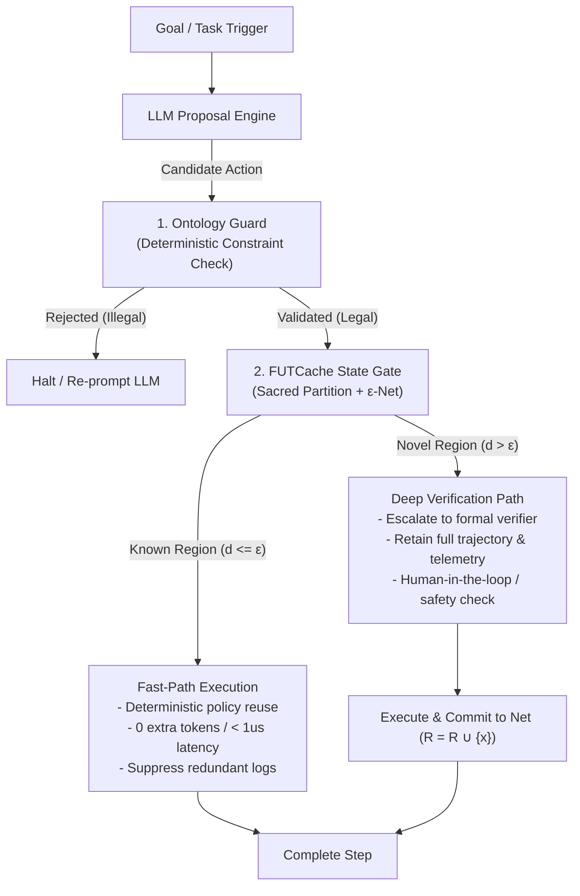
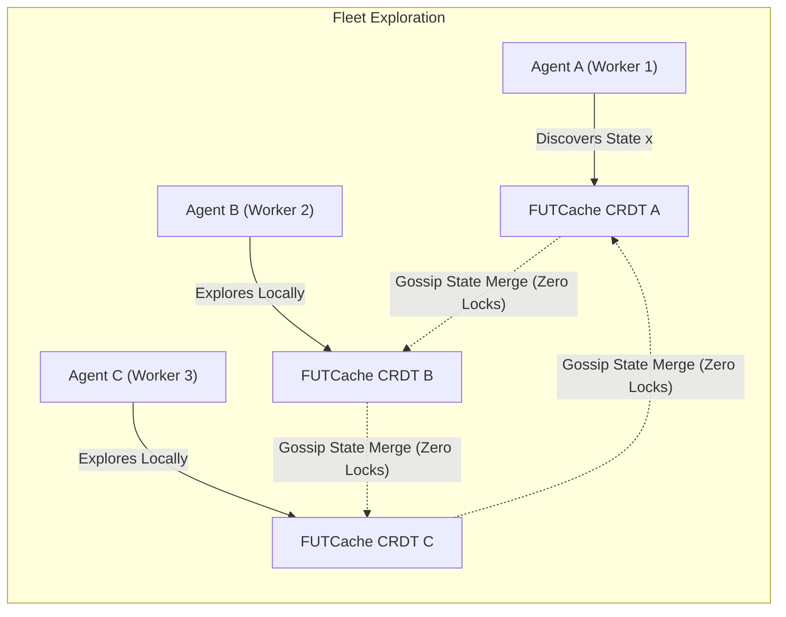

# Why FUTCache: Neurosymbolic Agent Memory & The Antidote to Lusser's Law

> **"Don't use the model as memory. Use symbolic constraints for meaning, and geometric coverage for experience."**

---

## 1. The Crisis in Agentic Memory & Lusser's Law

The current industry paradigm of "Agentic Memory" — storing chat history in vector databases, asking LLMs to summarize previous steps, or relying on probabilistic memory loops — is mathematically doomed to collapse in mission-critical environments.

### Lusser's Law of Compounding Failures
Lusser's Law states that the reliability of a sequential system is the product of the reliabilities of its individual components:

$$R_{\text{system}} = \prod_{i=1}^{N} r_i$$

Even if every single LLM decision benchmark boasts **$95\%$ accuracy ($r_i = 0.95$)**, a standard $20$-step agentic loop compounds to an overall success rate of:

$$R_{20} = (0.95)^{20} \approx \mathbf{35.8\%}$$

At $50$ steps, reliability drops to **$7.6\%$**. 

Relying on a probabilistic model to *"remember that this state is familiar"* or *"verify that this loop hasn't derailed"* turns agentic workflows into a game of Russian roulette. Probabilistic memory cannot provide deterministic operational safety.

---

## 2. The Neurosymbolic Architecture

The answer to this failure mode is **Neurosymbolic AI**: separating **meaning**, **experience**, and **generation** into specialized, deterministic substrates.

FUTCache is **not** an ontology, and it is **not** a chat memory store. FUTCache provides the missing **Deterministic Operational-State Compression & Novelty Layer**:

```
+-----------------------------------------------------------------------------------+
|  Component   | Role                         | Answers the Question               |
+-----------------------------------------------------------------------------------+
|  ONTOLOGY    | Meaning & Control Language   | "Is this action semantically legal?"|
|  FUTCACHE    | Visited Operational Geometry | "Have we explored this situation?"  |
|  LLM         | Stochastic Proposal Engine   | "What candidate action to try?"     |
+-----------------------------------------------------------------------------------+
```



---

## 3. The Adaptive Verification Gate

Instead of forcing an expensive LLM or heavy formal verifier to re-evaluate every single operational step from scratch, FUTCache acts as an **Adaptive Verification Gate**:

$$\text{LLM Proposal} \longrightarrow \text{Ontology Guard} \longrightarrow \text{FUTCache Check} \longrightarrow \begin{cases} \text{Known Region } (d(x, R) \le \varepsilon) & \longrightarrow \mathbf{\text{Cheap Deterministic Path}} \\ \text{Novel Region } (d(x, R) > \varepsilon) & \longrightarrow \mathbf{\text{Deep Verification Path}} \end{cases}$$

### Defeating Lusser's Law
When an agent enters a known, previously verified operational state ($d(x, R) \le \varepsilon$), you do **not** invoke another stochastic reasoning chain. You execute the known-safe deterministic policy with **$100\%$ reliability ($r_i = 1.0$)**.

This breaks the multiplicative probability decay, restoring multi-step agent workflows to production-grade stability.

---

## 4. Resolving the Semantic Safety Paradox

In unstructured embedding spaces, geometric proximity does **not** guarantee semantic equivalence (e.g. *"Cancel order"* and *"Confirm order"* have high cosine similarity).

FUTCache resolves this cleanly through **Two-Stage Partitioning**:

### Stage 1: Sacred Symbolic Partition (Ontology)
Exact symbolic fields can **never** be merged or approximated:
$$K = (\text{Workflow Type}, \text{Tool ID}, \text{Permission Class}, \text{Business Object}, \text{Policy State})$$

### Stage 2: Continuous Metric Geometry (FUTCache $\varepsilon$-Net)
Within a single sacred partition, FUTCache packs the continuous operational telemetry:
$$x(s) = (\text{Execution Latency}, \text{Retry Count}, \text{Resource Usage}, \text{Confidence}, \text{Call Depth}, \text{Output Statistics})$$

$$\boxed{\text{Two states can only merge geometrically AFTER they agree on exact semantic constraints.}}$$

This guarantees:
1. **Zero semantic leakage:** Actions with different permissions or business objects live in distinct partitions.
2. **Zero geometric explosion:** Minor floating-point execution jitter (e.g. 12ms vs 14ms latency) is absorbed into the $\varepsilon$-ball without fragmenting memory.

---

## 5. The Geometric Blackboard for Multi-Agent Fleets

When $50$ or $1,000$ autonomous agents explore complex problem spaces, they suffer from **redundant rediscovery**: multiple agents repeatedly explore the same failing or suboptimal operational regions.

FUTCache’s state-based **CRDT engine** (`futcache_crdt`) turns the representative net into a **conflict-free Geometric Blackboard**:

$$R_{\text{global}} = R_1 \sqcup R_2 \sqcup \cdots \sqcup R_n$$



### The Benefits:
* **Zero lock contention:** Agents merge visited-set coverage asynchronously without a central coordinator.
* **Shared experience without data deluge:** Agents do not transmit massive raw trajectory streams ($H_t$) to each other. They broadcast only the minimal representative net ($R \subset H_t$).
* **Global Novelty Awareness:** If Agent A encounters an edge case and records its geometric signature, Agent B instantly recognizes that territory as already visited and avoids redundant work.

### Empirical Convergence & Gossip Schedule

The CRDT join-semilattice convergence guarantee (PHASE2.md 12.29) was
validated empirically at fleet sizes up to 256, with three gossip
schedules (see `bench/crdt_fleet.c`):

| Fleet W | Joint cells (target 14) | Dedup ratio | k=1 (rounds) | k=⌈log₂ W⌉ (rounds) | k=W-1 (rounds) |
|---:|---:|---:|---:|---:|---:|
| 8   | 14 | 0.125 | 5 | 3 | 1 |
| 32  | 14 | 0.031 | 6 | 2 | 1 |
| 128 | 14 | 0.0078 | 7.6 (mean) | 2 | 1 |
| 256 | 14 | 0.0039 | 8.6 (mean) | 2 | 1 |

**Every worker reaches the single-worker reference joint in 2 gossip
rounds with `k=⌈log₂ W⌉`, at W=256 total latency 3.1 ms vs full fan-in's
37 ms — a 12× speedup.** This is the empirical confirmation of the
join-semilattice theorem for the practical gossip schedules that real
fleet deployments use.

---

## 6. Mathematical State Compression

For an agent history of $t$ observations:

$$H_t = (s_1, s_2, \ldots, s_t)$$

Standard agent architectures require memory growing linearly with time ($O(t)$).

Under FUTCache, future novelty decisions depend only on the covered $\varepsilon$-neighborhoods. The sufficient state is bounded by the **packing number $P(K, \varepsilon)$**:

$$|R_t| \le P(K, \varepsilon) = O(1) \quad \text{as } t \to \infty$$

Even if an autonomous system runs continuously for years, its operational visited-set remains physically bounded and deterministically queryable in microseconds.

---

## 7. Summary

| Traditional Agent Memory | The Neurosymbolic + FUTCache Paradigm |
|---|---|
| Probabilistic LLM summaries & vector KNN. | Deterministic Ontology + Geometric Visited-Set. |
| Subject to Lusser's Law ($R \to 0$ over loops). | Known states execute via deterministic fast-paths ($r = 1.0$). |
| Memory grows linearly ($O(N)$) until context overflow. | Memory bounded by geometric packing $P(K, \varepsilon) = O(1)$. |
| Multi-agent fleets rediscover the same failures repeatedly. | CRDT Geometric Blackboard shares explored territory instantly. |

> **"Ontology governs meaning and control. FUTCache governs operational geometry and experience. The LLM simply proposes."**
