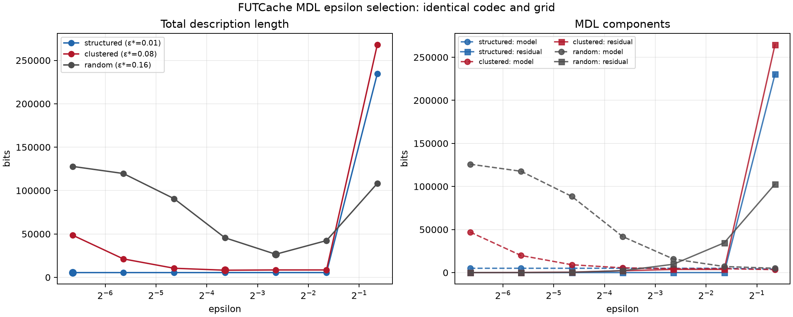

# Controlled MDL epsilon comparison

This is an offline experiment around the existing `futcache_mdl_select_epsilon`
API. It does not add a cache algorithm, metric learning, local radii, or
topological state.

## Reproduce

```sh
cmake --build build-test-release --target futcache_mdl_stream_comparison
build-test-release/futcache_mdl_stream_comparison > /tmp/mdl-streams.csv
python3 scripts/plot_mdl_streams.py /tmp/mdl-streams.csv \
  plots/mdl_stream_comparison.png
```

All streams contain `n=256` two-dimensional points, use the same deterministic
Euclidean metric, the same domain `[0,1]^2`, the same epsilon grid
`{0.01, 0.02, 0.04, 0.08, 0.16, 0.32, 0.64}`, and the same lossy codec with
distortion weight `λ=5000`. The program prints the complete curve as CSV.



## Selected minima

| stream | ε* | representatives | model bits | residual bits | total bits |
| --- | ---: | ---: | ---: | ---: | ---: |
| repetitive/structured | 0.01 | 4 | 4,992 | 0.000 | 5,505.000 |
| clustered | 0.08 | 5 | 5,504 | 2,133.205 | 8,233.940 |
| uniform random | 0.16 | 25 | 15,744 | 9,689.038 | 26,624.451 |

The model term is the exact live pack allocation in bits. The residual column
is `λ` times the total squared nearest-representative distance. The complete
CSV also reports representative-index and epsilon-code costs; those, plus
model and residual costs, produce the reported total.

## Why the minima move

- The repetitive stream has only four recurring sites. Once ε is small enough
  to preserve those sites, shrinking ε does not increase the model or residual
  cost, so the first grid point wins (the curve is nearly flat).
- The clustered stream reaches a five-representative description near ε=0.08.
  Finer radii spend many model bits on within-cluster variation; coarser radii
  save model bits but incur enough distortion to lose.
- The random stream keeps many representatives at fine radii and therefore has
  a large model code. Its minimum shifts coarser, to ε=0.16, where the model
  reduction outweighs the increased residual code.

These are comparisons against fixed ε values on the same grid; the selector
only chooses the shortest measured description among those candidates.
